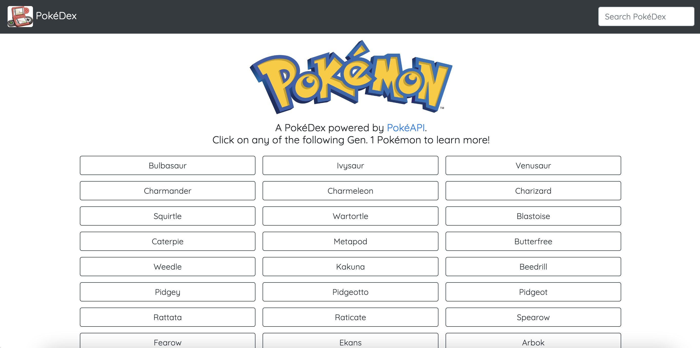
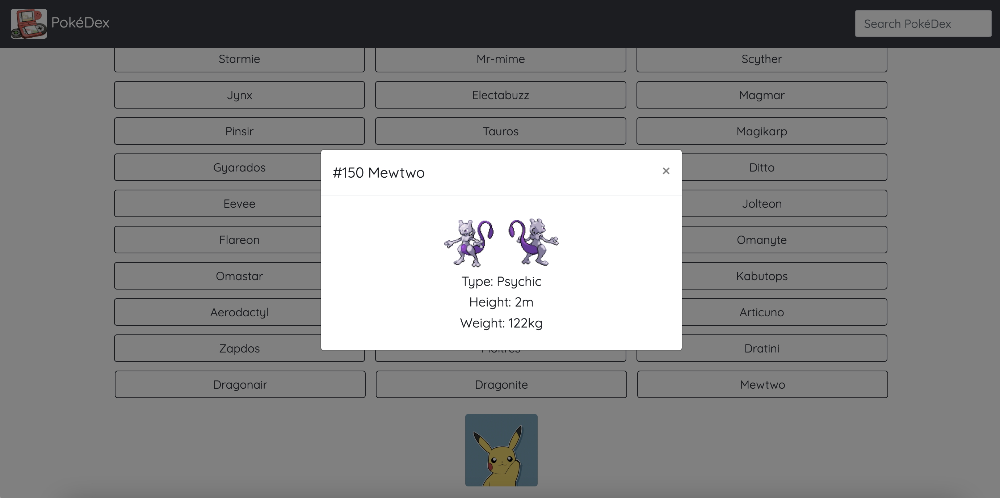

# PokeDex Application

### About:
A PokeDex application that loads data from an external API (PokeAPI).
The site displays buttons which when clicked, open a modal with details on the selected Pokemon.
Information on the first 251 Pokemon can be accessed.

Visit the website here: https://ysx-brian.github.io/PokeDex-App/

Main Page:     

Modal View:  

### Languages/Libraries used:
HTML  
CSS  
JavaScript  
JQuery 3.5.1  
Bootstrap 4.2

### To get the project running:
Click on any Pokemon to see its appearance and statistics.
Close the modal by clicking either the top right 'X' or outside the modal. 'Esc' on the keyboard also works.
A search bar on the top right of the page can be used to find a specific Pokemon.

The website works on all major browsers - Chrome, Firefox, Safari, Opera, and Edge.
Site can also be accessed via mobile or desktop.

### API:
https://pokeapi.co/
